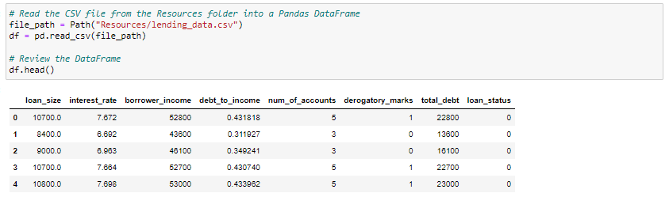
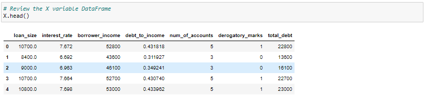

# credit-risk-classification

# Split the Data into Training and Testing Sets

Read the lending_data.csv data from the Resources folder into a Pandas DataFrame.

Create the labels set (y) from the “loan_status” column, and then create the features (X) DataFrame from the remaining columns.

*A value of 0 in the “loan_status” column means that the loan is healthy. A value of 1 means that the loan has a high risk of defaulting.

# Create a Logistic Regression Model with the Original Data

Fit a logistic regression model by using the training data (X_train and y_train).

Save the predictions for the testing data labels by using the testing feature data (X_test) and the fitted model.

Evaluate the model’s performance by doing the following:

Generate a confusion matrix.

Print the classification report.

# Credit Risk Analysis Report

## Overview of the Analysis

In this analysis, the purpose was to develop a machine learning model to predict credit risk.  The dataset used for this model contained information for loan applications, such as loan amount, interest rate, and applicant's total debt. The objective was to predict credit risk.  Which are separated between two classes, healthy or high-risk loans. The analysis included various stages of the machine learning process.  These were splitting the data into training and testing sets, model training using logistic regression, and random oversampling.  The logistic regression models were used for both the original data and resampled training data.

## Results

### Logistic Regression with Original Data:

-Balanced Accuracy: 0.95

-Precision (Label 0): 1.00

-Precision (Label 1): 0.88

-Recall (Label 0): 0.99

-Recall (Label 1): 0.91

### Logistic Regression with Resampled Data:

-Balanced Accuracy: 0.99

-Precision (Label 0): 1.00

-Precision (Label 1): 0.84

-Recall (Label 0): 0.99

-Recall (Label 1): 0.99

## Summary

The logistic regression model with resampled data performed better than the model with the original data because of its balanced accuracy, precision, and recall scores.  This is probably because RandomOverSampler helped with the balance of the training process.  This model is highly recommended due to the balanced accuracy of 99%, balanced precision and recall scores for both healthy and high-risk loans.  However, this can depend on the company's priorities.  If predicting high risk loans(Label 1) is more important, the model with resampled data is recommended.  The only downside with this is that it's more critical in labeling the loans as high risk, which will probably lead to fewer false positives.

